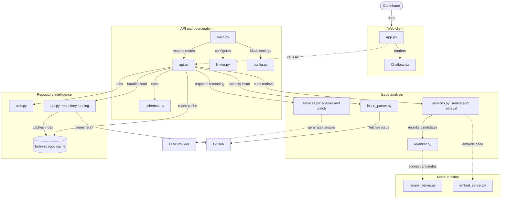

# Contrib

> Open source for Open source.

[](https://github.com/suso-van/Contrib)

🔗 **Repository:** https://github.com/suso-van/Contrib

Understand any GitHub repository and get from an issue to a fix, faster.

Contrib is a tool for open-source contributors. Point it at a GitHub repository and an issue, and it will parse the issue, search the codebase for the files that matter, rerank them, and use an LLM to produce an answer and a suggested patch. A built-in repository chat lets you ask questions about the codebase along the way.

## Features

- **Repository chat**: ask questions about a codebase in natural language.
- **Issue parsing**: fetch a GitHub issue and extract what it is actually asking for.
- **Semantic code search**: embed code and retrieve relevant candidates.
- **File reranking**: a dedicated rerank model scores candidates so the best files rise to the top.
- **Answer and patch generation**: an LLM explains the issue and proposes a patch.
- **Repo caching**: cloned and indexed repositories are cached so repeat queries are fast.
- **Rate limiting**: built-in protection for the API.

## Architecture



### Components

| Layer | Component | File | Responsibility |
|---|---|---|---|
| Web client | App workflow | `App.jsx` | Top-level UI workflow; calls the API |
| Web client | Repository chat | `Chatbox.jsx` | Chat interface for asking about a repo |
| API | API app | `main.py` | App entry point; configures rate limiting, loads settings, mounts routes |
| API | API routes | `api.py` | HTTP endpoints; coordinates every downstream service |
| API | Runtime settings | `config.py` | Environment and runtime configuration |
| API | Rate limiting | `limiter.py` | Request throttling |
| API | Request schemas | `schemas.py` | Request/response validation |
| Issue analysis | Issue parsing | `issue_parser.py` | Extracts structured info from a GitHub issue |
| Issue analysis | Search and retrieval | `services.py` | Embedding-based retrieval of relevant code |
| Issue analysis | File reranking | `reranker.py` | Reranks retrieved candidates |
| Issue analysis | Answer and patch | `services.py` | Builds prompts and generates the answer and patch via the LLM |
| Repository intelligence | GitHub and code utilities | `utils.py` | Helpers for GitHub and code handling |
| Repository intelligence | Repository loading | `api.py` | Clones repositories and builds the index |
| Repository intelligence | Indexed repo cache | `api.py` | Stores indexed repos for reuse |
| Model runtime | Rerank service | `rerank_server.py` | Serves the reranking model |
| Model runtime | Embedding service | `embed_server.py` | Serves the code embedding model |
| External | LLM provider | n/a | Generates answers and patches |
| External | [GitHub](https://github.com) | n/a | Source of repositories and issues (fetched via the [GitHub REST API](https://docs.github.com/en/rest)) |

## How it works

1. **Load**: the contributor enters a repository. The API clones it from GitHub, indexes it, and stores the result in the repo cache.
2. **Parse**: for an issue, the API fetches it from GitHub and extracts the key details.
3. **Retrieve**: code is embedded through the embedding service and matched against the issue to find candidate files.
4. **Rerank**: the rerank service scores the candidates so the most relevant files come first.
5. **Answer**: the top context is sent to the LLM provider, which returns an explanation and a suggested patch.
6. **Chat**: at any point, the contributor can ask follow-up questions about the repository in the chat box.

## Getting started

> Replace the placeholders below with your actual commands and paths.

### Prerequisites

- Python 3.10+
- Node.js 18+
- A GitHub access token
- An API key for your LLM provider

### Project structure

```
Contrib/
├── backend/     # API, retrieval, reranking, model servers
├── frontend/    # Web client (App.jsx, Chatbox.jsx)
└── .gitignore
```

### Clone

```bash
git clone https://github.com/suso-van/Contrib.git
cd Contrib
```

### Backend

```bash
cd backend
python -m venv .venv
source .venv/bin/activate
pip install -r requirements.txt
```

Create a `.env` file (read by `config.py`):

```env
GITHUB_TOKEN=your_github_token
LLM_API_KEY=your_llm_api_key
# add any other settings defined in config.py
```

Start the model services, then the API:

```bash
python embed_server.py     # embedding service
python rerank_server.py    # rerank service
uvicorn main:app --reload  # API
```

### Frontend

```bash
cd frontend
npm install
npm run dev
```

Open the URL printed in your terminal and start chatting with a repository.

## Configuration

All runtime settings live in `config.py`. Typical options include:

| Variable | Description |
|---|---|
| `GITHUB_TOKEN` | Token for fetching issues and cloning repositories |
| `LLM_API_KEY` | Key for the LLM provider |
| `EMBED_SERVER_URL` | Address of the embedding service |
| `RERANK_SERVER_URL` | Address of the rerank service |

Rate limits are configured in `limiter.py`.

## Contributing

Contributions are welcome.

1. Fork the repository and create a feature branch.
2. Make your changes and add tests where it makes sense.
3. Open a pull request describing what you changed and why.

## License

Add your license here (for example, MIT).
EOF
